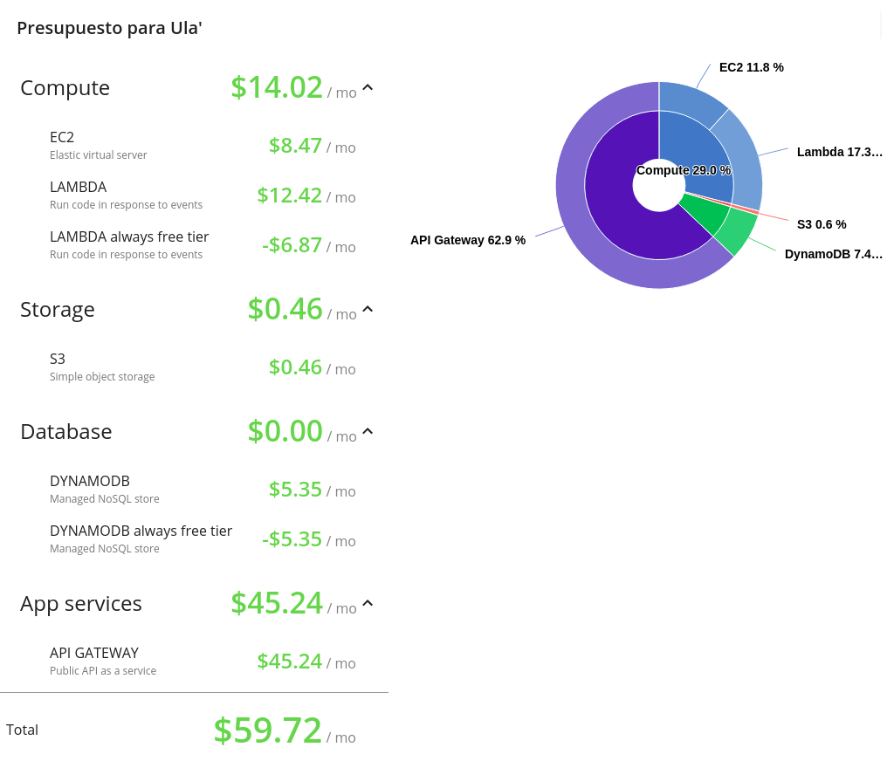

# ULA'

Desarrollado en el primer semestre del año 2021 en el curso de Seminario de Sistemas 1 por Asunción Mariana Sic Sor.


Contenido 
---
* [Objetivos](#objetivos)
    * [General](#general)
    * [Específicos](#específicos)
* [Descripción](#descripción)
* [Arquitectura Implementada](#arquitectura-implementada)
* [Presupuesto](#presupuesto)
* [Servicios Utilizados](#servicios-utilizados)

## Objetivos
### General
* Implementar tecnologías Cloud con servicios de Amazon Web Services (AWS) para innovar una herramienta relacionada con el turismo guatemalteco.

### Específicos
* Dar a conocer Guatemala a través de una herramienta digital para promover su turismo.
* Facilitar la comunicación de los turistas con ayuda de un traductor implementado en la aplicación.
* Hacer una comunidad para explorar y conocer los diferentes lugares de Guatemala a través de otros usuarios de Ula' que ya hayan visitado el país.

## Descripción
<p style="text-align:justify;">
<b>Ula'</b> (<em>"visita" en lengua maya Q'eqchi'</em>) nace a partir de la iniciativa por innovar en el área del turismo guatemalteco implementando tecnología reciente como lo son los servicios en la nube. El tener una herramienta tecnológica que apoye a toda persona que visite Guatemala vuelve más atractiva la experiencia de recorrer y conocer el país. </p>

<p style="text-align:justify;">
Con <b>Ula'</b> el turista podrá interactuar y almacenar los mejores momentos durante su estadía en el país. Para esto podrá usar las diferentes funciones que la aplicación ofrece, tales como crear itinerarios de viaje, asistente de voz, traducción de información de cada sitio turístico, creación de álbumes, proporcionar opiniones de sitios visitados con ayuda de chatbot, entre otros. </p>

<p style="text-align:justify;">
Sin dudad alguna, <b>Ula'</b> está destinado a ser un asistende de viaje que haga disfrutar más la estadía en Guatemala exhaltando su belleza al mismo tiempo que provee un acercamiento a tecnología actualizada. 
</p>

## Arquitectura Implementada


## Presupuesto
El presupuesto considerado mensual a utilizar para la aplicación de Ula' se detalla a continuación.



## Servicios utilizados

<table>
<thead>
<tr>
<td  style="text-align: center;">Servicio</td>
<td style="text-align: center;">Función</td>
<td style="text-align: center;">Descripción</td>
<td></td>
</tr>
</thead>
<tbody>
<tr>
<td rowspan="6"></td>
<td>registro</td>
<td>Función Lambda programada en python 3.6 para registrar un nuevo usuario</td>
<td rowspan="6"><a href="https://github.com/sicmmar/SEMI1_1S2021_PROYECTO_201504051/tree/main/backend/funciones_lambda">Código de Funciones Lambda</a></td>
</tr>
<tr>
<td>nuevoPost</td>
<td>Función Lambda programada en python 3.6 para realizar un nueva publicación</td>
</tr>
<tr>
<td>tarea4-semi1</td>
<td>Función Lambda programada en python 3.6 para ingresar a la plataforma con usuario y contraseña</td>
</tr>
<tr>
<td>obtenerPost</td>
<td>Función Lambda programada en python 3.6 para obtener las publicaciones de todos los usuarios</td>
</tr>
<tr>
<td>editarPerfil</td>
<td>Función Lambda programada en python 3.6 para editar datos de un usuario</td>
</tr>
<tr>
<td>ingresoFacial</td>
<td>Función Lambda programada en python 3.6 para ingresar a la plataforma con reconocimiento facial.</td>
</tr>
<tr>
<td rowspan="6"></td>
<td>/POST registrar</td>
<td>Petición POST integrada con Función Lambda de <b>registro</b></td>
<td><a href="https://ys642emfcc.execute-api.us-east-2.amazonaws.com/ulaApi/registrar">URL Endpoint</a></td>
</tr>
<tr>
<td>/POST newPost</td>
<td>Petición POST integrada con Función Lambda de <b>nuevoPost</b></td>
<td><a href="https://ys642emfcc.execute-api.us-east-2.amazonaws.com/ulaApi/newPost">URL Endpoint</a></td>
</tr>
<tr>
<td>/POST ingresar</td>
<td>Petición POST integrada con Función Lambda de <b>tarea4-semi1</b></td>
<td><a href="https://ys642emfcc.execute-api.us-east-2.amazonaws.com/ulaApi/ingresar">URL Endpoint</a></td>
</tr>
<tr>
<td>/POST getPost</td>
<td>Petición POST integrada con Función Lambda de <b>obtenerPost</b></td>
<td><a href="https://ys642emfcc.execute-api.us-east-2.amazonaws.com/ulaApi/getPost">URL Endpoint</a></td>
</tr>
<tr>
<td>/POST editarperfil</td>
<td>Petición POST integrada con Función Lambda de <b>editarPerfil</b></td>
<td><a href="https://ys642emfcc.execute-api.us-east-2.amazonaws.com/ulaApi/editarperfil">URL Endpoint</a></td>
</tr>
<tr>
<td>/POST ingresarweb</td>
<td>Petición POST integrada con Función Lambda de <b>ingresoFacial</b></td>
<td><a href="https://ys642emfcc.execute-api.us-east-2.amazonaws.com/ulaApi/ingresarweb">URL Endpoint</a></td>
</tr>
<tr>
<td></td>
<td>Máquina Virtual integrada con Docker y Docker Compose para el servidor de Python</td>
<td>Dockerfile: <br>

```Dockerfile
FROM python:alpine3.9
COPY . /api
WORKDIR /api
RUN pip install --upgrade pip
RUN pip install -r require.ula
EXPOSE 7050
CMD python app.py
```

</td>
<td><a href="http://3.21.75.136:7050/">http://3.21.75.136:7050/</a></td>
</tr>
<tr>
<td rowspan="2"></td>
<td>Tabla Usuario</td>
<td>Tabla utilizada para guardar los datos de un usuario</td>
<td>

```json
{
    "album": [
        [
        "Perfil",
        [
            
        ]
        ],
        [
        "Album1",
        [
            [
            "nombreFoto",
            "Descripción",
            "enlace a foto"
            ]
        ]
        ],
        **** Lista de Albumes
    ],
    "contrasena": "e10adc3949ba59",
    "etiquetas": [
        "31-47 años",
        "Sin Barba",
        "Usa Lentes",
        "Ojos Abiertos",
        "Mujer",
        "Sonriendo",
        "FELIZ"
    ],
    "foto_perfil": "enlace a foto de perfil",
    "nFoto": "perfil2-4012462254.jpg",
    "nombre": "Nombre Usuario",
    "pais": "pais de procedencia",
    "username": "usuario"
    }
```

</td>
</tr>
<tr>
<td>Tabla publicación</td>
<td>Tabla utilizada para guardar los datos de una publicación</td>
<td>

```json
{
    "departamento": "Sololá",
    "descripcion": "Lago precioso de Guatemala",
    "fechahora": "April 30, 2021 15:39:31",
    "foto": "enlace a foto",
    "id_pub": 2353752598,
    "lugar": "Panajachel",
    "pais": "Albania",
    "username": "usuario"
}
```

</td>
</tr>
<tr>
<td rowspan="3"></td>
<td>audios-ula</td>
<td>Bucket para almacenar las entradas y salidas necesarias que utiliza Amazon Transcribe</td>
<td rowspan="3"></td>
</tr>
<tr>
<td>imagenes-ula</td>
<td>Bucket para almacenar las imágenes necesarias en toda la aplicación</td>
</tr>
<tr>
<td>ula-app</td>
<td>Bucket para almacenar la página web estática</td>
</tr>
<tr>
<td rowspan="2"></td>
<td>compare_faces()</td>
<td>Método para comparar dos rostros</td>
<td>

```python
compare_faces(
    SourceImage={
        'S3Object':{
            'Bucket':BUCKET_NAME,'Name': NAME
            }
        }, 
    TargetImage={
        'Bytes':base64.b64decode(image_data)
        },
    SimilarityThreshold=81)
```

</td>
</tr>
<tr>
<td>detect_faces()</td>
<td>Método para comparar detectar rostros en una imágen</td>
<td>

```python
detect_faces(
    Image={
    'S3Object':{
            'Bucket':BUCKET_NAME,'Name': ubicacion
        }
    },Attributes=['ALL'])
```

</td>
</tr>
<tr>
<td></td>
<td>translate_text()</td>
<td>Método para traducir texto de un idioma origen a uno destino</td>
<td>

```python
translate_text(
    Text=texto,
    SourceLanguageCode=idioma_origen,
    TargetLanguageCode=idioma_destino
)
```

</td>
</tr>
<tr>
<td rowspan="2"></td>
<td>start_transcription_job()</td>
<td>Inicia un trabajo para transcribir speech-to-tex</td>
<td>

```python
start_transcription_job(
    TranscriptionJobName='job'
    MediaFormat='wav',
    Media={
        'MediaFileUri': 's3://audios-ula/nombre'
    },
    OutputBucketName=BUCKET_AUDIO,
    OutputKey='out'
    IdentifyLanguage=True,
    LanguageOptions=[
        'en-US','es-ES','es-US'
    ]
)
```

</td>
</tr>
<tr>
<td>get_transcription_job()</td>
<td>Obtiene un trabajo de speech-to-tex para obtener su texto</td>
<td>

```python
get_transcription_job(
    TranscriptionJobName='job'
)
```

</td>
</tr>
<tr>
<td></td>
<td>Manejo de Usuarios</td>
<td>Creación de distintos usuarios para llevar un orden de políticas de los diferentes servicios descritos anteriormente</td>
<td></td>
</tr>
</tbody>
</table>