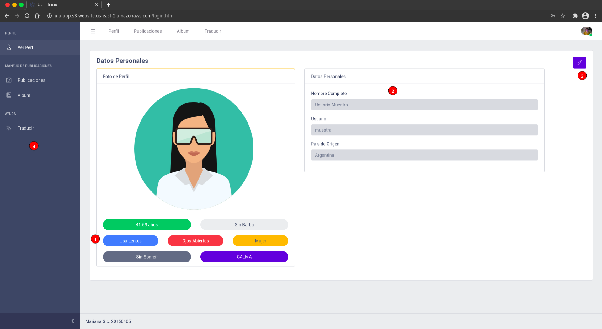

# ULA'

Desarrollado en el primer semestre del año 2021 en el curso de Seminario de Sistemas 1 por Asunción Mariana Sic Sor.

Contenido 
---
* [Objetivos](#objetivos)
* [Descripción](#descripción)
* [Utilizando Ula'](#utilizando-ula')
    * [Registrarse](#registrarse)
    * [Ingresar a plataforma](#ingresar-a-plataforma)
        * [Con Credenciales](#con-credenciales)
        * [Con Reconocimiento Facial](#con-reconocimiento-facial)
    * [Perfil](#perfil)
        * [Editar datos de perfil](#editar-datos)
    * [Publicaciones](#publicaciones)
        * [Ver Publicaciones](#ver-publicaciones)
        * [Nueva Publicación](#nueva-publicación)
    * [Vista de álbumes](#álbum)
    * [Traductor](#traductor)
    * [Salir de Plataforma](#salir-de-plataforma)
    

## Objetivos
* Que el usuario sea capaz de utilizar la plataforma Ula'
* Dar a conocer las funcionalidades de Ula'
* Dar a conocer Guatemala mediante el uso divertido y atractivo de Ula'

## Descripción

<b>Ula'</b> (<em>"visita" en lengua maya Q'eqchi'</em>) nace a partir de la iniciativa por innovar en el área del turismo guatemalteco implementando tecnología reciente como lo son los servicios en la nube. El tener una herramienta tecnológica que apoye a toda persona que visite Guatemala vuelve más atractiva la experiencia de recorrer y conocer el país. 

Con <b>Ula'</b> el turista podrá interactuar y almacenar los mejores momentos durante su estadía en el país. Para esto podrá usar las diferentes funciones que la aplicación ofrece, tales como crear itinerarios de viaje, asistente de voz, traducción de información de cada sitio turístico, creación de álbumes, proporcionar opiniones de sitios visitados con ayuda de chatbot, entre otros. 

Sin dudad alguna, <b>Ula'</b> está destinado a ser un asistende de viaje que haga disfrutar más la estadía en Guatemala exhaltando su belleza al mismo tiempo que provee un acercamiento a tecnología actualizada. 

## Utilizando Ula'

### Registrarse
Para formar parte de Ula', se requieren los siguientes datos:
* Usuario (debe de ser único)
* Nombre Completo
* País de Origen
* Contraseña
* Confirmación de contraseña
* Elegir foto de perfil

 
### Ingresar a plataforma
Para ingresar a la plataforma de Ula' hay dos opciones, mediante credenciales o por medio de reconocimiento facial

#### Con Credenciales
La plataforma solicita usuario y contraseña en dado caso se ingresa con credenciales

#### Con reconocimiento facial
Para esta opción es necesario haber ingresado el nombre del usuario el cual quiera ingresar a Ula'

### Perfil
En la página de perfil se muestran los datos del usuario, su foto de perfil y sus respectivas etiquetas.

1. Etiquetas de la foto de perfil de usuario
2. Datos personales del usuario
3. Botón de editar datos de usuario
4. Navegación entre páginas

#### Editar Datos
En esta opción se pueden editar o actualizar datos del usuario como: 

* Nombre Completo
* Foto de Perfil

Seguido de confirmar con contraseña actual

### Publicaciones

#### Ver Publicaciones
En esta sección se pueden ver las publicaciones de todos los usuarios

1. Lista de todas las publicaciones realizadas por todos los usuarios Ula'
2. Crear una nueva publicación

#### Nueva Publicación
Para crear una nueva publicación se siguen los siguientes pasos

1. Cargar la foto de la publicación
2. Una breve descripción (_opcional_)
3. Escribir el nombre donde se tomó la foto
4. Departamento donde se ubica el lugar
5. Opción de guardar foto en álbum personal
6. ¡Publicar!

### Álbum
En esta sección se pueden observar
1. Las distintas fotos de perfil que el usuario a utilizado (en álbum _Perfil_)
2. Varios álbumes creados automáticamente según distintas categrías a las que pertenezca la foto guardada

### Traductor
Esta opción está destinada a traducir a varios idiomas. Los pasos a seguir para utilizar, son:

1. Escribir el texto a traducir
2. Escoger el idioma de origen y el destino
> El idioma origen tiene la opción de detección automático
> esto con la opción _Automático_
3. Clic en _Traducir_
4. El texto traducido se despliega en el área _Texto Salida_

### Salir de plataforma
Para salir de Ula' 

1. Clic encima de foto de perfil ubicada en la esquina superior derecha
2. Clic en salir

